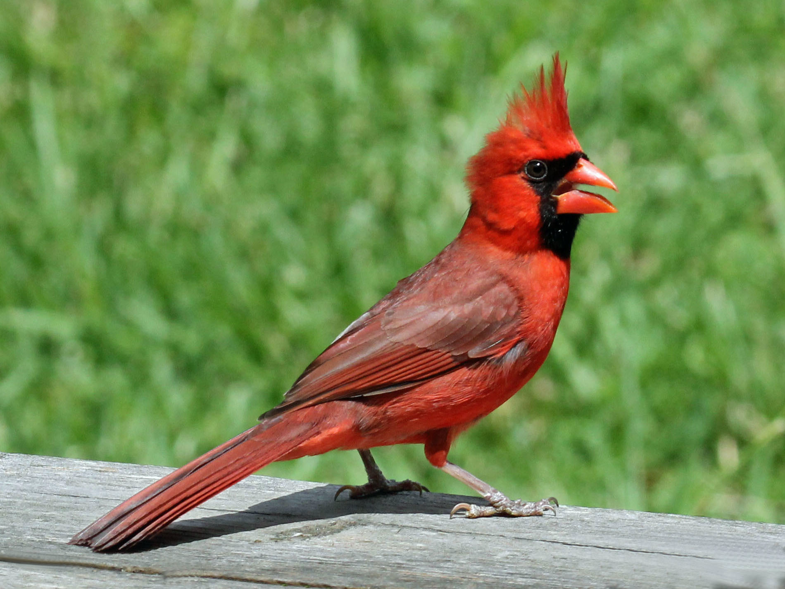

# B. Field Lab: Introduction to bioacoustics {-}
```{r , echo=FALSE, out.width = '25%',fig.align='center',fig.cap='Red Cardinal By DickDaniels (http://carolinabirds.org/)'}


```

## Part 1. Overview {-}
As we have learned in lecture, animals communicate through a variety of modalities including visual, auditory and chemical. In lab this week we will focus on bioacoustics techniques, or the study of animal sounds and their habitats. For this lab you will need access to a smartphone or device with recording capabilities, a place where you can record vocal animals and a notebook to write down your observations. 

NOTE: If you do not have access to a recording device and/or do not feel you can do this lab outside safely please contact me for a virtual option. 

### Recording on your smartphone {-}

Please see the website below for tips to record using your smartphone. It would be better to download one of the free apps listed that records sound files as '.wav'. If this is not possible you can send me your recordings in the format you have and I can convert them for you.

https://support.ebird.org/en/support/solutions/articles/48001064305-smartphone-recording-tips

### Developing your research questions {-}
For this lab we will be recording sounds from focal animals as well as recording the entire  combination of sounds in a particular environment (known as the soundscape). When recording focal animals we can test for differences between species, populations, individuals or even call types within the same individual. Differences in soundscapes may be related to differences in human activity or overall biodiversity of the different areas. For the first part of this lab you will want to develop specific research goals for both focal recordings and soundscape recordings. 

*Question 1.* Which focal animals will you record, and what are your predictions? Will you record two or more individuals to look for individual differences? Or multiple species?  
*Question 2.* What soundscapes will you record, and how do you predict that they will vary? Will you record the dawn and dusk chorus, or a rural and urban area?

## Part 2. Focal recordings {-}
Focal recordings are generally done using a hand-held, battery operated recording device in the presence of human observer. Focal recordings are used for testing hypotheses related to behavior of the focal animal(s), and the goal is to get high-quality recordings that can be used for subsequent analysis. But, getting high-quality recordings of your target animal is not easy! 

For this part of the lab, you are going to record short (5-10 seconds each) focal recordings of any target species. Coordinate with your partner so that you will have the same taxonomic focus (e.g. birds, insects, frogs). Aim to get 3-5 recordings of each species, individual or call type. Once you are done give your recordings standardized informative names following the format below (this will help with our analysis later):

Partner 1: ‘BirdSpecies1_a.wav’, ‘BirdSpecies1_b.wav’, ‘BirdSpecies1_c.wav’

Partner 2: ‘BirdSpecies2_a.wav’, ‘BirdSpecies2_b.wav’, ‘BirdSpecies2_c.wav’

To be good scientists, make sure to write down the day, time, location of recordings and any weather notes! 

Important: Once you have your recordings please email them to me so that I can make sure they are converted to the right format.

*Question 3.* What did you and your partner decide to record? What was your sample size? What did you notice about the calling behavior of your target species?
*Question 4.* Did you encounter any difficulties during data collection?


## Part 3. Soundscapes {-}
Traditionally, studies of animal behavior relied on human observers, but the use of technology (e.g. acoustic recorders and camera traps) has greatly expanded the spatial and temporal scales that researchers can collect data. Battery-operated, autonomous acoustic recorders can collect data on all vocal animals at the same time, and generally have a farther detection range than camera traps. Scientists have become increasingly interested in understanding how soundscapes vary over space and time, and in relations to human disturbance.

### Part 3a. Study Design {-}
For this part of the lab you and your partner are going to design a small study that will investigate variation in soundscapes at different times (e.g. dawn and dusk) and different locations (e.g. urban versus rural). For each time and location, we will want 3-5 recordings that are the same duration. In an ideal world we would record continuously for 24 hours, but due to space limitations please limit each individual recording to 20 seconds.

*Question 5:* In the space below briefly outline your study design and predictions. Do you predict there will be more animals calling at a particular time, or at a particular location? How long will you wait in between recordings?

### Part 3b. Data collection {-}
Now collect your data! While you are recording, use your notebook write down all the sounds that you hear. If you don’t know the species no problem! Once you are done please format your recordings in the following way:

Partner 1: ‘Site1_Morning_0800.wav’, ‘Site1_Morning_0805.wav’

Partner 1: ‘‘Site2_Evening_1800.wav’, ‘‘Site2_Evening_1805.wav’

Important: Once you have your recordings please email them to me so that I can make sure they are converted to the right format.

*Question 5*. What did you notice during data collection? Were there any differences in the recording times or locations? 

*Question 6*. Do you feel you were able to document all of the sounds you heard in your notebook? Did you encounter any difficulties? 


