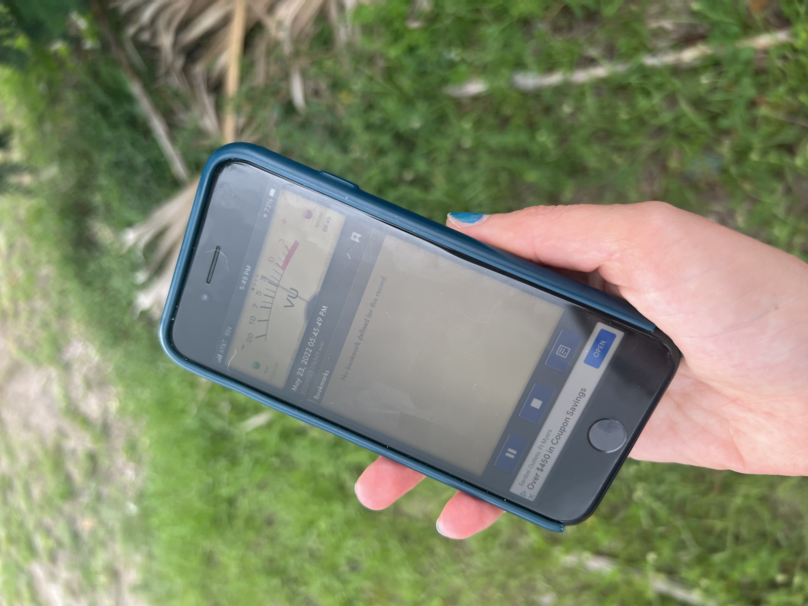

--- 
title: "Fundamentals of bioacoustics using smartphones and R"
author: "Dena J. Clink, Isabel A. Comella & Maryam Zafar"
date: "`r Sys.Date()`"
site: bookdown::bookdown_site
output: bookdown::gitbook
documentclass: book
bibliography: [book.bib, packages.bib]
biblio-style: apalike
link-citations: yes
github-repo: rstudio/bookdown-demo
description: ""
---

# Welcome {-}
```{r , echo=FALSE, out.height='25%', out.width = '25%',fig.align='center',fig.cap='Recording soundscapes using a smartphone'}


```

## Summary {-}
The purpose of this lab exercise is to introduce students to bioacoustics, or the study of animal sounds and their habitats. For the field component, students use their smartphones to collect focal recordings of target animals as well as collect acoustic data that will be used to investigate variation in soundscapes at different times (e.g. dawn and dusk) and/or different locations (e.g. urban versus rural). The computer lab component utilizes the R programming environment to import sound files and visualize differences in acoustic data using both spectrograms and principal component analysis biplots.

## Learning outcomes {-}
In this lab students will learn some of the basics of digital recording as well as some ways in which scientists analyze their acoustic data. After completing this lab students will be able to:  
1. Describe the difference between focal and soundscape recordings, and the types of questions that can be addressed with each.  
2. Read spectrograms and explain how scientists use them for scientific research.  
3. Understand basic data visualization techniques scientists use to investigate differences in acoustic data.  
4. Apply these data visualization techniques to data that the students collected using their smartphones.

